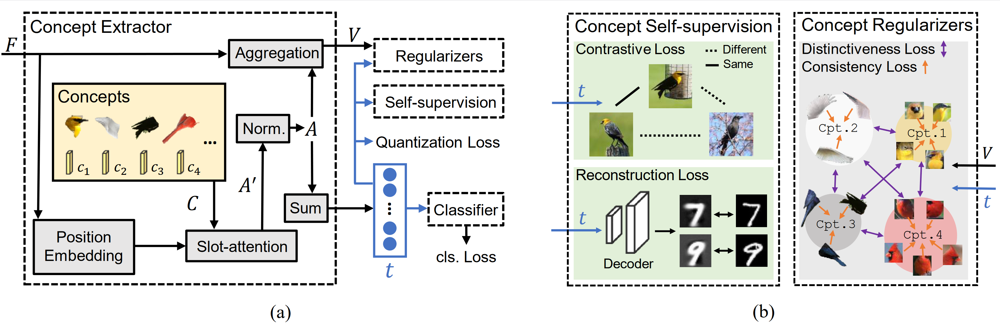

# BotCL: Learning Bottleneck Concepts in Image Classification

## Model Structure


## Abstract
Interpreting and explaining the behavior of neural networks is critical for many tasks. Explainable AI provides a way to address this challenge, mostly by providing per-pixel importance on the decision in a post-hoc paradigm. Yet, interpreting such explanations may still require expert knowledge. Some recent attempts toward interpretability adopt a concept-based framework, giving a higher-level relationship between some concepts and model decisions. This paper proposes Bottleneck Concept Learner (BotCL). BotCL represents an image solely by the presence/absence of concepts learned through training over the target task without explicit supervision over the concepts. BotCL uses tailored regularizers so that learned concepts can be human-understandable. Using some image classification tasks as our testbed, we demonstrate BotCL's potential to remodel neural networks for better interpretability.

## Usage

#### Data Set
Download CUB or ImageNet and set them into direction of your "dataset_dir". You can also make your own dataset with the structure similar to ImageNet and name it as Custom.
For the generation of Synthetic, use following command and a new folder names "matplob" will be generated.
```
python loaders/generate_matplob.py
```

#### Usage for MNIST
Using the following command for training
```
python main_recon.py --num_classes 10 --num_cpt 20 --lr 0.001 --epoch 50 --lr_drop 30
```
Use the following command for the inference of a sample. You can change the index to select different input samples. Change deactivate (deactivate one concept, 1 to num_class) and see the changes of reconstruction. Change top-sample (top-10 in the paper) to show more details for a concept. Visualization for the input sample and all concepts are shown at folder "vis" and "vis_pp", respectively. 
```
python vis_recon.py --num_classes 10 --num_cpt 20 --index 0 --top_sample 20 --top_sample 20 --deactivate -1
```

#### Usage for CUB200, ImageNet, Synthetic and Custom
We first pre-train the backbone and then train the whole model. For ImageNet, Synthetic and Custom, just change the name for dataset.
```
Pre-training of backbone:
python main_retri.py --num_classes 50 --num_cpt 20 --base_model resnet18 --lr 0.0005 --epoch 60 --lr_drop 40 --pre_train True --dataset CUB200 --dataset_dir "your dir"

Training for BotCL:
python main_retri.py --num_classes 50 --num_cpt 20 --base_model resnet18 --lr 0.0005 --epoch 60 --lr_drop 40 --dataset CUB200 --dataset_dir "your dir" --weak_supervision_bias 0.1 --quantity_bias 0.1 --distinctiveness_bias 0.01 --consistence_bias 0.05
```

Use the following commend to visualize the learned concept.

```
First run process.py to extarct the activation for all dataset samples:
python process.py

Then see the generated concepts by:
python vis_retri.py --num_classes 50 --num_cpt 20 --base_model resnet18 --index 300 --top_sample 20 --dataset CUB200
```